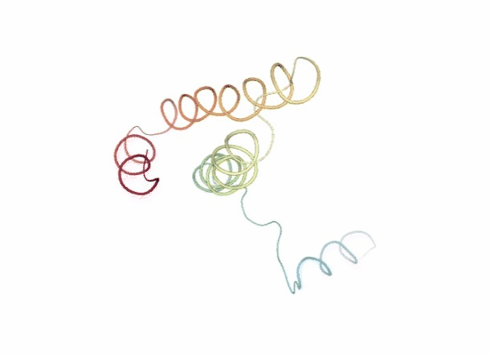
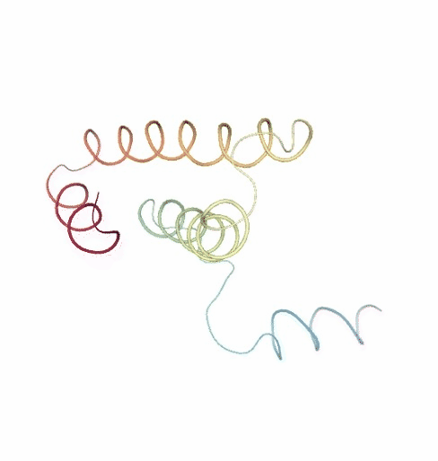

# Protein structure flexibility tutorial using BioExcel Building Blocks (biobb) and FlexServ tools
### Based on the FlexServ server: https://mmb.irbbarcelona.org/FlexServ/

***
This tutorial aims to illustrate the process of generating **protein conformational ensembles** from **3D structures** and analysing its **molecular flexibility**, step by step, using the **BioExcel Building Blocks library (biobb)**. 

The notebook reproduces the **workflow** integrated in the **[FlexServ](https://mmb.irbbarcelona.org/FlexServ/)** web-based tool for the **analysis** of **protein flexibility**. The **workflow** incorporates powerful protocols for the **coarse-grained** determination of **protein dynamics** using different versions of **Normal Mode Analysis (NMA)**, **Brownian dynamics (BD)** and **Discrete Dynamics (DMD)**. It also includes a set of **flexibility analyses** using a large variety of metrics, including basic **geometrical analysis**, **B-factors**, **essential dynamics**, **stiffness analysis**, **collectivity measures**, **Lindemann’s indexes**, **residue correlation**, **chain-correlations**, **dynamic domain determination**, **hinge point detections**, etc. Data is represented using **NGL 3D-structure visualizer** and **Plotly 2D plots**.

The particular structure used is the **Ribosomal Protein S15 from Bacillus Stearothermophilus** (PDB code [1A32](https://www.rcsb.org/structure/1A32)).

The codes wrapped are the ***FlexServ*** and ***PCAsuite*** tools:

**FlexServ: an integrated tool for the analysis of protein flexibility.**<br>
*Bioinformatics, Volume 25, Issue 13, 1 July 2009, Pages 1709–1710.*<br>
*Available at: https://doi.org/10.1093/bioinformatics/btp304*

**PCA suite**: https://mmb.irbbarcelona.org/software/pcasuite/

**Essential Dynamics:  A Tool for Efficient Trajectory Compression and Management.**<br>
*J. Chem. Theory Comput. 2006, 2, 2, 251–258*<br>
*Available at: https://doi.org/10.1021/ct050285b*

**pyPcazip: A PCA-based toolkit for compression and analysis of molecular simulation data.**<br>
*SoftwareX, Volume 5, 2016, Pages 44-50*<br>
*Available at: https://doi.org/10.1016/j.softx.2016.04.002*

***

## Settings

### Biobb modules used

 - [biobb_flexserv](https://github.com/bioexcel/biobb_flexserv): Tools to compute biomolecular flexibility on protein 3D structures.
 - [biobb_io](https://github.com/bioexcel/biobb_io): Tools to fetch biomolecular data from public databases.
 - [biobb_structure_utils](https://github.com/bioexcel/biobb_structure_utils): Tools to modify or extract information from a PDB structure.
 - [biobb_analysis](https://github.com/bioexcel/biobb_analysis): Tools to analyse Molecular Dynamics trajectories.
  
### Auxiliar libraries used

 - [nb_conda_kernels](https://github.com/Anaconda-Platform/nb_conda_kernels): Enables a Jupyter Notebook or JupyterLab application in one conda environment to access kernels for Python, R, and other languages found in other environments.
 - [ipywidgets](https://github.com/jupyter-widgets/ipywidgets): Interactive HTML widgets for Jupyter notebooks and the IPython kernel.
 - [nglview](https://nglviewer.org/#nglview): Jupyter/IPython widget to interactively view molecular structures and trajectories in notebooks.
 - [plotly](https://plotly.com/python/): Python Open Source Graphing Library. 
 - [simpletraj](https://github.com/arose/simpletraj): Lightweight coordinate-only trajectory reader based on code from GROMACS, MDAnalysis and VMD.


### Conda Installation and Launch

```console
git clone https://github.com/bioexcel/biobb_wf_flexserv.git
cd biobb_wf_flexserv
conda env create -f conda_env/environment.yml
conda activate biobb_wf_flexserv
jupyter-nbextension enable --py --user widgetsnbextension
jupyter-notebook biobb_wf_flexserv/notebooks/biobb_wf_flexserv.ipynb
  ``` 

***
## Pipeline steps
 1. [Input Parameters](#input)
 2. [Molecular Flexibility Representation/Generation](#intro)
     1. [Fetching PDB structure](#fetch)
     2. [Generate Coarse Grain structure](#coarse-grain)
     3. [Brownian Dynamics (BD)](#bd)
     4. [Discrete Molecular Dynamics (DMD)](#dmd)
     5. [Normal Mode Analysis (NMA)](#nma)
 3. [Molecular Flexibility Analyses](#flex)
     1. [PCA Zip compression](#pcazip) 
     2. [PCA Zip uncompression](#pcaunzip)      
     3. [PCA report](#pca_report)
     4. [PCA eigenvectors](#pca_eigenvectors)
     5. [PCA mode animations](#pcz_animate)
     5. [PCA Bfactors](#bfactors)
     6. [PCA hinge points](#hinge)
     7. [PCA Stiffness](#stiffness)
     8. [PCA collectivity index](#collectivity)
     9. [PCA similarity index](#similarity)
 4. [Questions & Comments](#questions)
 
***
<table>
    <tr style="background: white;"><td>
        
    </td>
        <td style="width: 100px;"></td>
    <td>
        
    </td></tr>
</table>


***

<a id="input"></a>
## Input parameters
**Input parameters** needed:

 - **Auxiliar libraries**: Libraries to be used in the workflow are imported once at the beginning
<br><br>
 - **pdbCode**: PDB code of the protein structure (e.g. 1A32)
 - **md_pcz**: PCZ file for the compressed 10-ns MD trajectory of the 1A32 protein taken from the [MoDEL](https://mmb.irbbarcelona.org/MoDEL/) database 


```python
import nglview
import simpletraj
import plotly
import plotly.graph_objs as go
import numpy as np
import ipywidgets
import json

pdbCode = "1a32"
#md_pcz = "Files/1a32.ca.1.pcz"
md_pcz = "Files/1a32.MoDEL.pcz"
```

<a id="intro"></a>
***

## Molecular Flexibility Representation/Generation

Despite recent advances in **experimental techniques**, the study of **molecular flexibility** is mostly a task for **theoretical methods**. The most powerful of them is **atomistic molecular dynamics** (MD), a rigorous method with solid physical foundations, which provides accurate representations of **protein flexibility** under **physiological-like environments**. Unfortunately, despite its power, MD is a **complex technique**, **computationally expensive** and their use requires a certain **degree of expertise**. The alternative to **atomistic MD** is the use of **coarse-grained** methods coupled to **simple potentials**. By using these techniques we assume a **lost of atomic detail** to gain formal and **computational simplicity** in the representation of near-native state **flexibility** of proteins. Unfortunately, despite its power, the practical use of coarse-grained methods is still limited, due mostly to the lack of **standardized protocols** for analysis and the existence of a myriad of different algorithms distributed in different websites.

**FlexServ** webserver and associated **BioBB module** integrate three **coarse-grained** algorithms for the representation of **protein flexibility**: 

i) **Brownian dynamics** (BD) <br>
ii) **Discrete dynamics** (DMD)<br>
iii) **Normal mode analysis** (NMA) based on different types of elastic networks <br>

This tutorial shows how to extract **molecular flexibility** (conformational ensemble) from a single, static structure **downloaded** from the **PDB database**, generating its **coarse-grained**, reduced representation (\\(C_{\alpha}\\)) and running the previously mentioned **coarse-grained algorithms**.

<a id="fetch"></a>
***

### Fetching PDB structure
Downloading **PDB structure** with the **protein molecule** from the RCSB PDB database.<br>
Alternatively, a **PDB file** can be used as starting structure. <br>
***
**Building Blocks** used:
 - [Pdb](https://biobb-io.readthedocs.io/en/latest/api.html#module-api.pdb) from **biobb_io.api.pdb**
***


```python
# Downloading desired PDB file 
# Import module
from biobb_io.api.pdb import pdb

# Create properties dict and inputs/outputs
downloaded_pdb = pdbCode+'.pdb'
prop = {
    'pdb_code': pdbCode,
    'api_id' : 'mmb'
}

#Create and launch bb
pdb(output_pdb_path=downloaded_pdb,
    properties=prop)
```

<a id="vis3D"></a>

#### Visualizing 3D structure
Visualizing the downloaded/given **PDB structure** using **NGL**: 


```python
# Show protein
view = nglview.show_structure_file(downloaded_pdb)
view.add_representation(repr_type='ball+stick', selection='allb')
view._remote_call('setSize', target='Widget', args=['','600px'])
view
```

</img>

<a id="coarse-grain"></a>
***

### Generate Coarse Grain Structure
Extracting the **alpha carbons** from the **protein structure** to generate a reduced, **coarse grain structure**. This structure is the one used by the different **FlexServ ensemble generators** (BD, DMD, NMA).<br> <br>
***
**Building Blocks** used:
 - [extract_atoms](https://biobb-structure-utils.readthedocs.io/en/latest/utils.html#module-utils.extract_atoms) from **biobb_structure_utils.utils.extract_atoms**
***


```python
from biobb_structure_utils.utils.extract_atoms import extract_atoms

ca_pdb = pdbCode + "_ca.pdb"

prop = {
    'regular_expression_pattern': '^CA'
}

extract_atoms(input_structure_path=downloaded_pdb,
            output_structure_path=ca_pdb,
            properties=prop)
```

<a id="vis3D_CA"></a>

#### Visualizing 3D structure
Visualizing the CA-only **PDB structure** using **NGL**: 


```python
# Show protein
view = nglview.show_structure_file(ca_pdb)
view.clear_representations()
view.add_representation(repr_type='ball+stick', selection='all', color='grey')
view._remote_call('setSize', target='Widget', args=['','600px'])
view
```

</img>

<a id="bd"></a>
***

### Brownian Dynamics

The **Brownian Dynamics** (BD) method introduces the protein in an **stochastic bath** that keeps the **temperature constant** and modulates the otherwise extreme oscillations of the residues. This bath is simulated with two terms accounting for a **velocity-dependent friction** and **stochastic forces** due to the **solvent environment**.
**Velocity Verlet** algorithm is used to solve the **stochastic differential equation** (equation of motion) for **alpha-carbons** (\\(C\alpha)\\):<br><br>

<center>
$$\large m\dot{\upsilon}_{i} = \gamma\upsilon_{i} + F_{i} + \eta_{i}$$
</center>
    
    
where **m** stands for the **effective mass** of **\\(C\alpha\\)** (see below), \\(\upsilon\\) and \\(\dot{\upsilon}\\) stands for velocity and acceleration, **F** represent the force, \\(\gamma\\) is the inverse of a characteristic **time at which the particle loses its energy in a given solvent**, and finally the **random term** is considered a Robust white noise \\(\eta(t)\\) with autocorrelation given by:<br><br>

<center>
$$\large \langle \eta_{l} (t) \space \eta_{n} (t^{\prime}) \rangle = 2mk_{B}T\gamma\delta_{ln}\delta(t - t^{\prime})$$
</center>
   
   
where **\\(k_{B}\\)** is the **Boltzmann constant**, and **t** is the **temperature of the stochastic bath**. The **Dirac functions** \\(\delta_{ln}\\) and \\(\delta(t - t^{\prime})\\) force the **independence of the components of the noise vector**.

The **equation of motion** is integrated using **Verlet’s algorithm**, giving for the **velocities** and **positions** after time:<br><br>

<center>
$$\large \vec{v}_{i} = e^{-\frac{\Delta t}{\tau}} \vec{v}_{i}^{0} + \frac{1}{\gamma} \left(1 - e^{-\frac{\Delta t}{\tau}} \right) \vec{F}_{i}^{0} + \Delta \vec{v}_{i}^{G}$$
</center>
   
and <br><br>

<center>
$$\large \vec{r}_{i} = \vec{r}_{i}^{0} + \tau \left( 1 - e^{-\frac {\Delta t} {\tau}} \right) \vec{v}_{i}^{0} + \frac {\Delta t} {\gamma} \left( 1 - \frac {\tau} {\Delta t} \left( 1 - e^{-\frac{\Delta t}{\tau}}  \right) \right) \vec{F_{i}} + \Delta \vec{r}_{i}^{G} $$
</center>

where \\(\tau = m \gamma^{-1}\\) is the **characteristic time**, and \\(\Delta \vec{r}_{i}^{G}\\), \\(\Delta \vec{v}_{i}^{G}\\)  are the **changes** in **position** and **velocity** induced by the **stochastic term**.

The **potential energy** used to compute **forces** in the **equation of motion** assumes a **coarse-grained representation of the protein** (\\(C\alpha\\)-only) and a **quasi-harmonic representation** of the **interactions** (similar to that suggested by [Kovacs et al. 2004](https://doi.org/10.1002/prot.20151)):<br><br>


<center>
$$\large U_{ij} = \frac {1} {2} C \left( \frac{r^{*}}{|{\vec{r}_{ij}^{0}}|} \right)^{6} \left(\vec{r}_{ij} - \vec{r}_{ij}^{0} \right)^{2}$$
</center>


where \\(r_{ij} = r_{i} - r_{j}\\) stands for the vector connecting \\(C\alpha\\) atoms i and j.

The initial condition is a **native structure** (or MD-averaged conformation) that is supposed to be in the **minimal energy state**, from which the **relative vectors** \\(\vec{r}_{ij}^{0}\\) are computed. After some tests, factor **C** is taken to be **40 kcal/mol Ų** and **r***, being the **mean distance** between two consecutive **\\(C\alpha\\) atoms**, is set to **3.8Å**. The **mass** of all \\(C\alpha\\) atoms is set to **100 daltons** (i.e, that of an average residue). The **velocity-dependent friction** \\(\gamma\\) is considered to have the same value as for water (i.e., 0.4 ps-1). Brownian Dynamics (BD) **simulation time scales** were equivalent to those considered in Molecular Dynamics (MD).


Reference: <br>
**Exploring the Suitability of Coarse-Grained Techniques for the Representation of Protein Dynamics.**<br>
*Biophysical Journal, Volume 95, Issue 5, 1 September 2008, Pages 2127-2138*<br>
*Available at: https://doi.org/10.1529/biophysj.107.119115*


***
**Building Blocks** used:
 - [bd_run](https://biobb-flexserv.readthedocs.io/en/latest/flexserv.html#module-flexserv.bd_run) from **biobb_flexserv.flexserv.bd_run**
***


```python
# Running Brownian Dynamics (BD)
# Import module
from biobb_flexserv.flexserv.bd_run import bd_run

# Create properties dict and inputs/outputs

bd_log = 'bd_ensemble.log'
bd_crd = 'bd_ensemble.mdcrd'

prop = {
    'binary_path': "bd",
    'time': 10000,
    'wfreq': 100
}

bd_run( 
     input_pdb_path=ca_pdb,
     output_crd_path=bd_crd,
     output_log_path=bd_log,
     properties=prop
)
```

<a id="bd_dcd"></a>
***

### Fitting and converting BD trajectory to DCD (visualization)
Fitting and converting the generated **Brownian Dynamics** (BD) **coarse-grained trajectory** from the **mdcrd** format to a **dcd** format, for the sake of visualization with **NGL** (see next cell).<br> <br>
***
**Building Blocks** used:
 - [cpptraj_rms](https://biobb-analysis.readthedocs.io/en/stable/ambertools.html#module-ambertools.cpptraj_rms) from **biobb_analysis.ambertools.cpptraj_rms**
***


```python
from biobb_analysis.ambertools.cpptraj_rms import cpptraj_rms

bd_rmsd = 'bd_ensemble_rmsd.dat'
bd_dcd = 'bd_ensemble.dcd'

prop = {
    'start': 1,
    'end': -1,
    'steps': 1,
    'mask': 'c-alpha',
    'reference': 'experimental'
}

cpptraj_rms(input_top_path=ca_pdb,
            input_traj_path=bd_crd,
            output_cpptraj_path=bd_rmsd,
            output_traj_path=bd_dcd,
            input_exp_path= ca_pdb,
            properties=prop)

```

<a id="vis3D_BD"></a>

#### Visualizing trajectory
Visualizing the **CG trajectory** using **NGL**: 


```python
# Show trajectory
view = nglview.show_simpletraj(nglview.SimpletrajTrajectory(bd_dcd, ca_pdb), gui=True)
view._remote_call('setSize', target='Widget', args=['','600px'])
view
```

</img>

<a id="dmd"></a>
***

### Discrete Molecular Dynamics

With the **Discrete Molecular Dynamics** (DMD) method, the proteins are modelled as a system of beads (\\(C\alpha\\) atoms) interacting through a **discontinuous potential** (square wells in the used tool). Outside the discontinuities, **potentials** are considered constant, thereby implying a **ballistic regime** for the particles (**constant potential, constant velocity**) in all conditions, except at such time as when the particles reach a **potential discontinuity** (this is called “an **event**” or “a **collision**”). At this time, the **velocities** of the colliding particles are modified by imposing **conservation of the linear momentum**, **angular momentum**, and **total energy**. Since the particles were constrained to move within a configurational space where the **potential energy** is constant (**infinite square wells**), the **kinetic energy** remains unchanged and therefore all collisions are assumed to be **elastic**.

**DMD** has a major advantage over techniques like **MD** because, as it does not require the **integration of the equations of motion** at fixed **time steps**, the calculation progresses **from event to event**. In practice, the time between events decreases with **temperature** and **density** and depends on the **number of particles
N** approximately as \\(N^{-\frac{1}{2}}\\). The **equation of motion**, corresponding to **constant velocity**, is solved analytically: <br><br>

<center>
$$\large \vec{r_{i}}(t + t_{c}) = \vec{r_{i}} (t) +  \vec{v_{i}}(t) \space t_{c}$$
</center>

where \\(t_{c}\\) is the **minimum** amongst the **collision times** \\(t_{ij}\\) between each **pair of particles** i and j, given by: <br><br>

<center>
$$\large t_{ij} = \frac{-b_{ij} \pm \sqrt{b_{ij}^{2} - v_{ij}^{2}\left (r_{ij}^{2} - d^{2} \right)}}{v_{ij}^{2}} $$
</center>

where \\(r_{ij}\\) is the square modulus of \\(\vec{r_{ij}}=\vec{r_j}-\vec{r_i}\\), \\(\nu_{ij}\\) is the square modulus of  \\(\vec{\nu_{ij}}=\vec{\nu_j}-\vec{\nu_i}\\), \\(b_{ij}=\vec{r_{ij}}\cdot\vec{\nu_{ij}}\\), and d is the distance corresponding to a **discontinuity** in the **potential** (the signs + and - before the radical are used for particles approaching one another and moving apart, respectively).

As the **integration of Newton’s equations** is no longer the rate limiting step, calculations can be extended for very **long simulation** periods and **large systems**, provided an efficient algorithm for **predicting collisions** is used.

The **collision between particles** i and j is associated with a **transfer of linear momentum** in the direction of the vector \\(\vec{r_{ij}}\\). Thus, <br><br>

<center>
$$\large m_{i}\vec{v_{i}} = m_{i}\vec{v_{i}^{\prime}} + \Delta \vec{p}$$ 
</center>

<center>
$$\large m_{j}\vec{v_{j}} + \Delta \vec{p} = m_{j}\vec{v_{j}^{\prime}}$$
</center>

where the **prime indices** variables **after the event**.

To calculate the **change in velocities**, the **velocity** of each **particle** is projected in the **direction of the vector** \\(\vec{r_{ij}}\\) so that the **conservation equations** become one-dimensional along the **interatomic coordinate**. <br><br>

<center>
$$\large m_{i}v_{i} = m_{i}v_{i}^{\prime} + \Delta p$$ 
</center>

<center>
$$\large m_{j}v_{j} + \Delta p = m_{j}v_{j}^{\prime}$$
</center>

which implies

<center>
$$\large m_{i}v_{i} +  m_{j}v_{j} = m_{i}v_{i}^{\prime} + m_{j}v_{j}^{\prime}$$ 
</center>

<center>
$$\large \frac{1}{2} m_{i}v_{i}^{2} + \frac{1}{2} m_{j}v_{j}^{2} = \frac{1}{2} m_{i}v_{i}^{\prime 2} + \frac{1}{2} m_{j}v_{j}^{\prime 2}$$ 
</center>

From the previous 4 equations, the **transferred momentum** is readily determined as:
<br><br>

<center>
$$\large \Delta p = \large \frac{2m_{i}m_{j}}{m_{i}+m_{j}} (v_{i} - v_{j})$$ 
</center>

and the final **velocities** of **particles** i and j are determined through the previous equations \\(m_{i}\vec{v_{i}}\\) and \\( m_{j}\vec{v_{j}} + \Delta \vec{p}\\).

The **interaction potentials** are defined as **infinite square wells**, such that the **particle-particle distances** vary between \\(d_{min}=(1-σ)r_{ij}^{0}\\) and \\(d_{max}=(1+σ)r_{ij}^{0}\\), \\(r_{ij}^{0}\\) being the **distance in the native conformation** and 2σ the **width of the square well**. The **MD-averaged conformation** is taken as the **native conformation**. **Residue-residue interaction potentials** are defined only for the **particles** at a distance smaller than a **cut-off radius** \\(r_{c}\\) in the native conformation. Otherwise the **particles** only interact via a hardcore **repulsive potential** that avoids **steric clashes**. For **non-consecutive \\(C\alpha\\) particles**, \\(r_{c} = 8 Å\\) and σ = 0.1 were used, while for **consecutive pairs of residues** a **smaller well width** (σ = 0.05) was chosen to keep the **Cα – Cα distances** closer to the expected value (3.8 Å).

***
**Building Blocks** used:
 - [dmd_run](https://biobb-flexserv.readthedocs.io/en/latest/flexserv.html#module-flexserv.dmd_run) from **biobb_flexserv.flexserv.dmd_run**
***


```python
# Running Discrete Molecular Dynamics (DMD)
# Import module
from biobb_flexserv.flexserv.dmd_run import dmd_run

# Create properties dict and inputs/outputs

dmd_log = 'dmd_ensemble.log'
dmd_crd = 'dmd_ensemble.mdcrd'

dmd_run( 
     input_pdb_path=ca_pdb,
     output_crd_path=dmd_crd,
     output_log_path=dmd_log
)
```

<a id="dmd_dcd"></a>
***

### Fitting and converting DMD trajectory to DCD (visualization)
Fitting and converting the generated **Discrete Molecular Dynamics** (DMD) **coarse-grained trajectory** from the **mdcrd** format to a **dcd** format, for the sake of visualization with **NGL** (see next cell).<br> <br>
***
**Building Blocks** used:
 - [cpptraj_rms](https://biobb-analysis.readthedocs.io/en/stable/ambertools.html#module-ambertools.cpptraj_rms) from **biobb_analysis.ambertools.cpptraj_rms**
***


```python
from biobb_analysis.ambertools.cpptraj_rms import cpptraj_rms

dmd_rmsd = 'dmd_ensemble_rmsd.dat'
dmd_dcd = 'dmd_ensemble.dcd'

prop = {
    'start': 1,
    'end': -1,
    'steps': 1,
    'mask': 'c-alpha',
    'reference': 'experimental'
}

cpptraj_rms(input_top_path=ca_pdb,
            input_traj_path=dmd_crd,
            output_cpptraj_path=dmd_rmsd,
            output_traj_path=dmd_dcd,
            input_exp_path=ca_pdb,
            properties=prop)
```

<a id="vis3D_DMD"></a>

#### Visualizing trajectory
Visualizing the **CG trajectory** using **NGL**: 


```python
# Show trajectory
view = nglview.show_simpletraj(nglview.SimpletrajTrajectory(dmd_dcd, ca_pdb), gui=True)
view._remote_call('setSize', target='Widget', args=['','600px'])
view
```

</img>

<a id="nma"></a>
***

### Normal Mode Analysis

**Normal Mode Analysis** (NMA) can be defined as the **multidimensional** treatment of **coupled oscillators** from the analysis of **force-derivatives** in **equilibrium conformations**. This methodology assumes that the **displacement** of an **atom** from its **equilibrium position** is small and that the **potential energy** in the vicinity of the **equilibrium position** can be approximated as a **sum of terms** that are **quadratic** in the **atomic displacements**. In its purest form, it uses the same **all-atom force field** from a **MD simulation**, implying a prior **in vacuo minimization** ([Go and Scheraga 1976](https://pubs.acs.org/cgi-bin/abstract.cgi/mamobx/1976/9/i04/f-pdf/f_ma60052a001.pdf?sessid=6006l3); [Brooks III, Karplus et al. 1987](https://adsabs.harvard.edu/abs/1990PhT....43b.120B)). 

[Tirion (1996)](https://link.aps.org/doi/10.1103/PhysRevLett.77.1905) proposed a **simplified model** where the **interaction** between two atoms was described by **Hookean pairwise potential** where the distances are taken to be at the minimum, avoiding the minimization (referred as **Elastic Network Model** -ENM-). This idea being further extended to use **coarse-grained** (\\(C\alpha\\)) protein representation by several research groups, as in the **Gaussian Network Model** -GNM- ([Bahar et al. 1997](https://linkinghub.elsevier.com/retrieve/pii/S1359027897000242); [Haliloglu et al. 1997](https://link.aps.org/doi/10.1103/PhysRevLett.79.3090)). The **GNM model** was later extended to a 3-D, vectorial **Anisotropic Network Model** -ANM-, which is the formalism implemented in the **FlexServ server** and the **BioBB FlexServ module** ([Atilgan et al. 2001](https://www.biophysj.org/cgi/content/abstract/80/1/505)). Through the **diagonalization** of the **hessian matrix**, the **ANM** provides **eigenvalues** and **eigenvectors** that not only describe the **frequencies** and **shapes** of the **normal modes**, but also their **directions**.

Within the **Elastic Network Model** approach (ENM) the network topology is described by a **Kirchhoff matrix** Γ of **inter-atomic contacts** where the ij-th element is equal to -1 if nodes (i.e. \\(C\alpha\\)) i and j are within the cutoff distance \\(r_{c}$, and zero otherwise, and the **diagonal elements** (ii-th) are equal to the **connectivity of the residue**:

<center>
$$\large \Gamma_{ii} = - \sum\limits_{k|k\neq i}^{N} \Gamma_{ik}$$
</center>

In the **ANM approach**, the **potential energy** between two residues i-j is given by:
<br><br>

<center>
$$\large E = 0.5 · \gamma · \Gamma_{ij} (r_{ij} - r_{ij}^{0})^{2}$$
</center>

where \\(r_{ij}\\) and \\(r_{ij}^{0}\\) are the **instantaneous** and **reference** (equilibrium) **position vectors** of atoms i and j and γ is the **force constant**; in the original formalism by Atilgan et al, γ=1 kcal/mol.Ų (see below).

For the sake of simplicity, the product of the **force constant** for a given i, j pair \\(γ_{ij}\\) and the corresponding **Kirchhoff matrix** element \\(Γ_{ij}\\) can be expresed as a single **stiffness constant** \\(K_{ij}\\):

<center>
$$\large K_{ij} = 0.5 · \gamma · \Gamma_{ij}$$
</center>

The **molecular Hamiltonian** is given by the **elastic energy** to displace a protein from its **equilibrium conformation**:
<br><br>

<center>
$$\large E_{ij} = \sum\limits_{i\neq j} K_{ij} (r_{ij} - r_{ij}^{0})^{2}$$
</center>

This **potential function** is used to build a **Hessian matrix** (H), a **3N x 3N matrix** (N is the **number of nodes** in the protein) defined as N x N submatrices \\(H_{ij}\\) containing the **second derivatives** of the **energy respect the coordinates** of each protein node. **Diagonalization** of the **Hessian** yields the **eigenvectors** (the essential deformation modes) and the associated **eigenvalues** (stiffness constants).

As presented, **NMA** defines **springs** between all pairs of residues with no zero elements in the corresponding **Kirchhoff matrix** element \\(Γ_{ij}\\). In principle all **inter-residue force-constants** have then two possible values: 0 if the residues are not connected (Kirchhoff matrix element equal to 0) and γ otherwise. The standard approach (Tirion 1996) defines the **connectivity index** by using an **spherical cutoff** \\(r_{c}\\):
<br><br>

<center>
$$\large \Gamma_{ij} = -1$$ if $$\large r_{ij}^{0} \le r_{c}$$ <br>
$$\large \Gamma_{ij} = 0$$ otherwise
</center>

**Cutoff distances** around 8-12 Å have been used, being the most usual the range 8-9 Angstroms, although some authors have explored values as high as 20-25 Å (Sen & Jernigan, 2006). Different **cut-off radii** can be used for different proteins based on **size**, **shape**, **density** or other **protein characteristics**.

Regarding the **force constant** parameter γ, many authors set values equal to 1, which means that **eigenvectors** have physical sense, but **eigenvalues** are not realistic. Alternatively, γ can be fitted to reproduce **X-ray B-factors** or **MD simulation** results.

This approximation, with **interactions** defined by an uniform γ within a **cutoff**, is referred to as **distance cutoff**, and despite its simplicity provides good descriptions of **large-scale molecular motions** (Bahar and Rader, 2005; Ma, 2005). However, the use of an **empirical cutoff**, though useful to eliminate **irrelevant interactions** and explore topological constraints in **equilibrium dynamics**, introduces a sharp discontinuity in the **Hamiltonian** and some degree of arbitrareness and uncertainty in the method. Other approaches have been developed to define **continuum functions** for the **spring constant**. Kovacs et al. (2004) developed a simple function that assumes an **inverse exponential relationship** between the **distance** and the **force-constant**:
<br><br>

<center>
$$\large K_{ij} = C \left ( \frac {r^{*}} {r_{ij}^{0}} \right)^{6} + as_{ij}$$
</center>

where C is a **stiffness constant** (taken as 40 kcal/mol Ų), r* is a **fitted constant**, taken as the mean \\(C\alpha - C\alpha\\) **distance** between consecutive residues (3.8 Angstroms), \\(r_{ij}^{0}\\) is the **equilibrium distance** between the \\(C\alpha\\) of residues i and j and \\(as_{ij}\\) is an **inter residue-residue constant surface**. In practice, the **surface correction** is small and has been ignored in our implementation of the method, available in the **FlexServ server** and **BioBB FlexServ module** as an alternative to standard **cutoff-based** method. This method maintains the simplicity of the original method and avoids the problems intrinsic to the use of a **.cutoff**. The major drawback is that, by connecting all residues in the network, both increases the **rigidity** of the system and lowers the **speed of the computation**.

The **cutoff-based** and **Kovac’s** versions of **NMA** were improved with **multi-parametric fitting** of **NMA** to **atomistic MD simulations** in a large number of proteins (CITE!!  Orellana et al., **to be published**). The refined method, which is available in the **FlexServ server** and the **BioBB FlexServ module**, defines a **network topology** by an effective **Kirchhoff matrix** Γ that is the sum of a **Rouse Chain topology matrix** for the first 3 neighbours, with a usual **Kirchhoff matrix** for **distant interactions**, rendering a mixed **connectivity matrix** that combines both **sequential** and **distant information**. Thus, given a pair of residues i, and j with sequential distance \\(S_{ij}>0\\) and **Cartesian distance** \\(r_{ij}\\), the ij-th element of the **inter-residue contact matrix** is defined as:
<br><br>

<center>
$$\Gamma_{ij}=\left\{\begin{matrix}\space S_{ij}<3 & \Gamma_{ij}=-1 \\ S_{ij}>3 & 
\left\{\begin{matrix} \Gamma_{ij}=-1 & if r_{ij}^0 \leq r_{c} \\ \Gamma_{ij}=0 & otherwise \end{matrix} \right\} 
\end{matrix}\right\}$$
</center>

The **distance** (both in Cartesian and Sequence space) dependence of the **force-constant**, and the associated **scaling factors** \\(C_{cart}\\) and \\(C_{seq}\\) were adjusted to reproduce **atomistic MD simulations** (\\(C_{seq}\\)=60 kcal/mol.Ų and \\(C_{cart}\\)=6 kcal/mol.Ų, lower or higher values can be considered for extremely small or large systems). The same **fitting procedure** was followed to obtain a **size-dependent cutoff distance** (\\(r_{c}\\)), that can be approximated with a **logarithmic function** of the protein length, with extreme values of 8 and 16 Angstroms for most proteins (up to 17-20 Angstroms for extremely large proteins, above 700 residues). Thus the **MD-ANM** mixed model combines an **MD calibrated inverse exponential function** with a **length-dependent cutoff** to discard **redundant interactions**, also improving **computational efficency**. The resulting network gives flexibility patterns closest to MD, being not only the **eigenvectors**, but also the **eigenvalues** more physically meaningful.

Our **FlexServ server** and **BioBB FlexServ module** implement the **ANM** formalism with the three different definitions of the **force constants** described above:

- The so called **linear** or **distance-cutoff** formalism, equal to the original **ANM** but with a default γ=10 kcal/mol.Ų for the **ANM linear implementation** as in [elNémo](http://www.sciences.univ-nantes.fr/elnemo/) ([Suhre & Sanejouand](https://doi.org/10.1093/nar/gkh368) (2004)). The default **cutoff value** in this case is 8Å, or 9Å for larger proteins (above 150-200 residues).


- The **Kovacs**, **inverse exponential** formalism, in which the **force constant** is defined by a **continuous function**; the default values of C=40 kcal/mol Ų, and \\(r_{ij}^{0}=3.8 Å\\) is used; \\(as_{ij}\\) term is neglected.


- The **Mixed** formalism, in which the **force constant** follows a complex definition with all parameters (\\(r_{c}$, \\(C_{cart}\\) and \\(C_{cont}\\)) fitted according to **MD simulations** as explained before:

<center>
$$K_{ij}=\left\{\begin{matrix} S_{ij}\leq 3 & K_{ij}=\frac{C_{seq}}{S_{ij}^2}\space \\ S_{ij}>3 & 
\left\{\begin{matrix}K_{ij}=\left(\frac{C_{cart}}{r_{ij}^0}\right)^6 & if r_{ij}^0\leq r_{c} \\ K_{ij}=0 & otherwise \end{matrix}\right)
\end{matrix}\right\}$$
</center>

Once **NMA** is performed and the set of **eigenvectors/eigenvalues** is determined, ***Cartesian pseudo-trajectories*** at **physiologic temperature** can be obtained by activating **normal mode deformations** using a **Metropolis Monte Carlo algorithm** with a **Hamiltonian** defined as shown above. The **displacements** obtained by such algorithm can then be projected to the **Cartesian space** to generate the ***pseudo-trajectories***. Note that by limiting the size of the sum in the **molecular hamiltonian equation** to only important **eigenvectors** (m’<n), the **trajectory** can be enriched in sampling of **essential deformation modes** ([Rueda et al. 2007a](https://linkinghub.elsevier.com/retrieve/pii/S0969212607001414)).

<center>
$$\large E = \sum \limits_{i=1}^{m^{\prime}} K_{i}\Delta D_{i}^{2}$$
</center>

where \\(K_i=\frac{k_BT}{2\lambda}\\) (λ being the eigenvalue in distance² units) and \\(\Delta D_{i}\\) is the displacement along the mode.

***
**Building Blocks** used:
 - [nma_run](https://biobb-flexserv.readthedocs.io/en/latest/flexserv.html#module-flexserv.nma_run) from **biobb_flexserv.flexserv.nma_run**
***


```python
# Running Normal Mode Analysis (NMA)
# Import module
from biobb_flexserv.flexserv.nma_run import nma_run

# Create properties dict and inputs/outputs

nma_log = 'nma_ensemble.log'
nma_crd = 'nma_ensemble.mdcrd'

prop = {
    'frames' : 50
}

nma_run( 
     input_pdb_path=ca_pdb,
     output_crd_path=nma_crd,
     output_log_path=nma_log,
     properties=prop
)
```

<a id="nma_dcd"></a>
***

### Fitting and converting NMA trajectory to DCD (visualization)
Fitting and converting the generated **Normal Mode Analysis** (NMA) **coarse-grained trajectory** from the **mdcrd** format to a **dcd** format, for the sake of visualization with **NGL** (see next cell).<br> <br>
***
**Building Blocks** used:
 - [cpptraj_rms](https://biobb-analysis.readthedocs.io/en/stable/ambertools.html#module-ambertools.cpptraj_rms) from **biobb_analysis.ambertools.cpptraj_rms**
***


```python
from biobb_analysis.ambertools.cpptraj_rms import cpptraj_rms

nma_rmsd = 'nma_ensemble_rmsd.dat'
nma_dcd = 'nma_ensemble.dcd'

prop = {
    'start': 1,
    'end': -1,
    'steps': 1,
    'mask': 'c-alpha',
    'reference': 'experimental'
}

cpptraj_rms(input_top_path=ca_pdb,
            input_traj_path=nma_crd,
            output_cpptraj_path=nma_rmsd,
            output_traj_path=nma_dcd,
            input_exp_path=ca_pdb,
            properties=prop)
```

<a id="vis3D_NMA"></a>

#### Visualizing trajectory
Visualizing the **CG trajectory** using **NGL**: 


```python
# Show trajectory
view = nglview.show_simpletraj(nglview.SimpletrajTrajectory(nma_dcd, ca_pdb), gui=True)
view._remote_call('setSize', target='Widget', args=['','600px'])
view
```

</img>

<a id="flex"></a>
***

## Molecular Flexibility Analyses


The following cells of the notebook incorporate a large variety of methods to **characterize flexibility**. From basic analysis like **structural oscillation** using **root mean square deviation** (RMSd) to more complex methods such as **Essential Dynamics** (ED) routines (Amadei, et al., 1993). **Essential Dynamics** technique, based in the well-known **Principal Components Analyisis** (PCA) statistical method, is extensively used to characterize the most important **deformation modes** obtained by **diagonalization** of the **trajectory covariance matrix**. The **eigenvectors** represent the nature of the **essential deformation patterns**, while the **eigenvalues** can be transformed into the **frequencies** or **stiffness** of these movements. **Essential deformation movements** are ranked by importance and can be visualized and processed to obtain information (see Meyer, et al., 2006; Rueda, et al., 2007a for a detailed explanation), such as **B-Factor profiles**, the **collectivity index** (a measure of the collective nature of protein motions, Brüschweiler, 1995), the **variance profile**, the **dimensionality** (the number of movements defining a percentage of variance), or the **size of the essential space** (the number of modes with eigenvalues > 1 Ų). **Lindemann’s indexes** are computed to evaluate the **liquid/solid** nature of the entire or partial regions of the protein (Rueda, et al., 2007b; Zhou, et al., 1999).

Advanced capabilities include calculation of the **apparent stiffness between interacting residues** (obtained by inverting the inter-residue covariance, Rueda, et al., 2007a) and the **determination of residue-correlations** using different algorithms that allow the user to filter non-relevant or spurious correlations.

Other advanced tools allow the determination of **dynamic domains** and **hinge points** using a variety of techniques: i) exploration of the B-factor landscape after fitting with the gaussian RMSd method, ii) analysis of the force-constant profile (Sacquin-Mora and Lavery, 2006) and iii) clustering by inter-residue correlation (Navizet, et al., 2004). Calculations are performed using different sliding windows to reduce noise and false positives.

In all the analysis the resulting data is presented as a **json-formatted files**, and **2D plots** are generated when appropriate.


<a id="pcazip"></a>
***

### PCAsuite: Compressing trajectory

**PCAsuite** is used to compress **Molecular Dynamics (MD) trajectories** using **Principal Component Analysis (PCA)** algorithms. This technique offers a good **compression ratio** at the expense of **losing some precision** in the trajectory.

One of the main shortcomings to popularize the use of **Molecular Dynamics** is its potentially **large trajectory files**. State-of-the-art simulations in the high **nanosecond time scale** can span easily **several GB**, especially for **large systems**. Traditional general **compression algorithms** like **Lempel–Ziv–Welch (LZW)** ([Lemple, Welch, Ziv, 1984](https://doi.org/10.1109/MC.1984.1659158)) have been used in order to reduce the required space, but they usually do not perform well with this kind of data. However, trajectory data is not random. It follows **patterns** with well defined meaning that can be exploted for **data compression**. In particular, **higher frequency movements** can be discarded without affecting the **overall dynamics** of the system. **Principal Component Analysis** is one of the most used techniques to capture the **essential movements** of a **macromolecular system**. It implies a change in the **coordinate space** where reference **eigenvectors** are chosen according to the amount of system **variance explained**. The aim is to select the **minimum number of reference coordinates** that explain a given amount of **system variance**. The technique allows to select the **degree of fidelity** to the **original trajectory**. Chosing all **eigenvectors** there is no change in the accurancy of the trajectory. However, removing **eigenvectors** with the lowest amount of **explained variance**, has little effect on the overall behavior of the system, but has a remarkable effect on the **size of the data**.

Let's suppose we have a **MD trajectory** of **N atoms** and **F frames**. The first action is to prepare the input for the real **processing** and **compression**. Trajectory must be **superimposed** onto a **representative structure**. This would **minimize the oscilations** around the average structure and, hence, **minimize the number of required eigenvectors**. This action is performed in three steps:

- **Superimpose** all the snapshots of the trajectory **onto the first one**
- Compute the **average snapshot** after the first step
- **Superimpose** all the snapshots **onto the computed average**

The **superimposition** is performed looking for the **best RMSd fit**. This value can be computed using two different algorithms:

- A standard, **Kabsch-based**, RMSd algorithm
- A **Gaussian RMSd** algorithm ([Damm & Carlson, 2006](https://doi.org/10.1529/biophysj.105.066654)) that gives **more weight** to the **still atoms** and **less weight** to the **moving atoms**

The **gaussian RMSd** algorithm may help to reduce the **number of eigenvectors** needed for a given compression, thus reducing the **size of the compressed file**. The **gaussian RMSd** algorithm also allows for other analysis, like the **hinge point prediction**, much more difficult and imprecise using a **standard RMSd** algorithm.

The first step is to compute the **covariance matrix** of the trajectory, where the **random variables** are the **coordinates of the N atoms**. This leads to a **symmetric square matrix** of **3N x 3N dimensions**. The matrix is then **diagonalized** to get the associated **eigenvalues and eigenvectors**. The sum of all the **eigenvalues** is the **total variance** of the trajectory, and the individual **eigenvalues** are the **variance quantity** explained by the corresponding **eigenvector**. Using this data the number of **eigenvectors** that explain the desired percentage of the **total variance** can be selected (NV). A higher number of **eigenvector** implies a more accurate representation of the **original trajectory**, but leads to a lower **compression rate**.

Once the **eigenvectors** have been selected, coordinates of the **original F frames** are **projected** onto the new **coordinate space**. The final output of the algorithm contains the **average structure**, the **eigenvectors** and the **calculated projections**. The **size of stored coordinates** is reduced from **F x 3N** to **F x 3NV**. **PCA suite** also stores other information, like the **eigenvalues** and the **atom names** to allow to perform the analysis and manipulations in a quick and more flexible way.

**PCA suite** works natively with the **PCZ4 format** (also supporting files stored in old PCZ2 and PCZ3 formats). All the formats are **binary-based**.

The next cell is **compressing** the previously generated **coarse-grained** trajectory file. 

References: <br>

**PCA suite**: https://mmb.irbbarcelona.org/software/pcasuite/

**Essential Dynamics:  A Tool for Efficient Trajectory Compression and Management.**<br>
*J. Chem. Theory Comput. 2006, 2, 2, 251–258*<br>
*Available at: https://doi.org/10.1021/ct050285b*

**pyPcazip: A PCA-based toolkit for compression and analysis of molecular simulation data.**<br>
*SoftwareX, Volume 5, 2016, Pages 44-50*<br>
*Available at: https://doi.org/10.1016/j.softx.2016.04.002*

***
**Building Blocks** used:
 - [pcz_zip](https://biobb-flexserv.readthedocs.io/en/latest/pcasuite.html#module-pcasuite.pcz_zip) from **biobb_flexserv.pcasuite.pcz_zip**
***


```python
from biobb_flexserv.pcasuite.pcz_zip import pcz_zip

bd_pcz = 'bd_ensemble.pcz'
dmd_pcz = 'dmd_ensemble.pcz'
nma_pcz = 'nma_ensemble.pcz'

prop = {
    'variance': 90,
    'neigenv' : 10,
    'gauss_rmsd' : True
}

pcz_zip( input_pdb_path=ca_pdb,
        input_crd_path=bd_crd,
        output_pcz_path=bd_pcz,
        properties=prop)

pcz_zip( input_pdb_path=ca_pdb,
        input_crd_path=dmd_crd,
        output_pcz_path=dmd_pcz,
        properties=prop)

pcz_zip( input_pdb_path=ca_pdb,
        input_crd_path=nma_crd,
        output_pcz_path=nma_pcz,
        properties=prop)
```

<a id="pcaunzip"></a>
***

### PCAsuite: Uncompressing trajectory

The **PCA suite** **data compression** method based on **principal component analysis** works remarkably well with **MD trajectory data**, permitting files to be reduced to typically less than **one tenth** of their **original size** with very acceptable levels of approximation. 

The **compressed trajectory** can also be **uncompressed** (back-projected) to an atomistic **ASCII mdcrd format**, although, as expected, the neglect of **fast intramolecular vibration** (lossy compression) generates some deviations of **bond lengths** and **angles** from the **optimum** values and eventually to some **incorrect van der Waals contacts**. However, these alterations do not affect **key intramolecular interactions** such as **stacking** or **hydrogen bond** interactions. When the **compression procedure** is performed using only the **first eigenvector** (typically explaining between 20 and 35% of the variance), the **RMSd** between original and back-projected conformations is reduced to 1-3 Å (in average). When the space is expanded to consider the **first 10 eigenvectors** (around 50-60% of the total variance), the RMSd is similar or less than 1 Å (in average). The error is reduced to around 0.3 Å (10 ns trajectories) or 0.5 Å (100 ns trajectories) when the **important eigenvectors** are defined using a **95% variance cutoff** and to around 0.1 (10 ns trajectories) and 0.2 (100 ns trajectory) Å when the **99% variance cutoff** is used. 

The **compression method** is exact when **all the eigenvectors** are considered. However, its **computational efficiency** should increase as trajectory behaves more **harmonically**. Thus, the method is **less accurate** when working with trajectories following **irreversible transitions** (nonequilibrium trajectories). 

Overall, the **compression procedure** provides a set of **coordinates** that is nearly **indistinguishable** (for most purposes) from the **original ones**, with the size of the **compressed files** being on average from **8% to 20%** reduced compared with the size of the **original trajectories**. The reduction becomes more evident for **longer trajectories**. 

The next cell is **uncompressing** a **PCZ-formatted** file. 

***
**Building Blocks** used:
 - [pcz_unzip](https://biobb-flexserv.readthedocs.io/en/latest/pcasuite.html#module-pcasuite.pcz_unzip) from **biobb_flexserv.pcasuite.pcz_unzip**
 - [cpptraj_rms](https://biobb-analysis.readthedocs.io/en/stable/ambertools.html#module-ambertools.cpptraj_rms) from **biobb_analysis.ambertools.cpptraj_rms**
***


```python
# Uncompressing the PCZ files
from biobb_flexserv.pcasuite.pcz_unzip import pcz_unzip

bd_crd_uncompressed = 'bd_ensemble_uncompressed.crd'
dmd_crd_uncompressed = 'dmd_ensemble_uncompressed.crd'
nma_crd_uncompressed = 'nma_ensemble_uncompressed.crd'

pcz_unzip(input_pcz_path=bd_pcz,
        output_crd_path=bd_crd_uncompressed)

pcz_unzip(input_pcz_path=dmd_pcz,
        output_crd_path=dmd_crd_uncompressed)

pcz_unzip(input_pcz_path=nma_pcz,
        output_crd_path=nma_crd_uncompressed)

# Converting from mdcrd to DCD format (visualization)
from biobb_analysis.ambertools.cpptraj_rms import cpptraj_rms

bd_uncompressed_rmsd = 'bd_ensemble_uncompressed.rmsd.dat'
bd_dcd_uncompressed = 'bd_ensemble_uncompressed.dcd'
dmd_uncompressed_rmsd = 'dmd_ensemble_uncompressed.rmsd.dat'
dmd_dcd_uncompressed = 'dmd_ensemble_uncompressed.dcd'
nma_uncompressed_rmsd = 'nma_ensemble_uncompressed.rmsd.dat'
nma_dcd_uncompressed = 'nma_ensemble_uncompressed.dcd'

prop = {
    'start': 1,
    'end': -1,
    'steps': 1,
    'mask': 'c-alpha',
    'reference': 'experimental'
}
cpptraj_rms(input_top_path=ca_pdb,
            input_traj_path=bd_crd_uncompressed,
            output_cpptraj_path=bd_uncompressed_rmsd,
            output_traj_path=bd_dcd_uncompressed,
            input_exp_path= ca_pdb,
            properties=prop)

cpptraj_rms(input_top_path=ca_pdb,
            input_traj_path=dmd_crd_uncompressed,
            output_cpptraj_path=dmd_uncompressed_rmsd,
            output_traj_path=dmd_dcd_uncompressed,
            input_exp_path= ca_pdb,
            properties=prop)

cpptraj_rms(input_top_path=ca_pdb,
            input_traj_path=nma_crd_uncompressed,
            output_cpptraj_path=nma_uncompressed_rmsd,
            output_traj_path=nma_dcd_uncompressed,
            input_exp_path= ca_pdb,
            properties=prop)
```

<a id="vis3D_PCZ_BD"></a>

#### Visualizing trajectory
Visualizing the **original** and the **uncompressed BD trajectories** using **NGL**, for the sake of comparison: 


```python
# Show BD original vs uncompressed trajectories
view1 = nglview.show_simpletraj(nglview.SimpletrajTrajectory(bd_dcd, ca_pdb), gui=True)
view1._remote_call('setSize', target='Widget', args=['','600px'])
view1
view2 = nglview.show_simpletraj(nglview.SimpletrajTrajectory(bd_dcd_uncompressed, ca_pdb), gui=True)
view2._remote_call('setSize', target='Widget', args=['','600px'])
view2
ipywidgets.HBox([view1, view2])
```

</img></img>

<a id="vis3D_PCZ_DMD"></a>

#### Visualizing trajectory
Visualizing the **original** and the **uncompressed DMD trajectories** using **NGL**, for the sake of comparison: 


```python
# Show DMD original vs uncompressed trajectories
view1 = nglview.show_simpletraj(nglview.SimpletrajTrajectory(dmd_dcd, ca_pdb), gui=True)
view1._remote_call('setSize', target='Widget', args=['','600px'])
view1
view2 = nglview.show_simpletraj(nglview.SimpletrajTrajectory(dmd_dcd_uncompressed, ca_pdb), gui=True)
view2._remote_call('setSize', target='Widget', args=['','600px'])
view2
ipywidgets.HBox([view1, view2])
```

</img></img>

<a id="vis3D_PCZ_NMA"></a>

#### Visualizing trajectory
Visualizing the **original** and the **uncompressed NMA trajectories** using **NGL**, for the sake of comparison: 


```python
# Show NMA original vs uncompressed trajectories
view1 = nglview.show_simpletraj(nglview.SimpletrajTrajectory(nma_dcd, ca_pdb), gui=True)
view1._remote_call('setSize', target='Widget', args=['','600px'])
view1
view2 = nglview.show_simpletraj(nglview.SimpletrajTrajectory(nma_dcd_uncompressed, ca_pdb), gui=True)
view2._remote_call('setSize', target='Widget', args=['','600px'])
view2
ipywidgets.HBox([view1, view2])
```

</img></img>

<a id="pca_report"></a>
***

### PCAsuite: Principal Components Analysis Report

The result of the **PCA analysis** is the generation of a set of **eigenvectors** (the modes or the principal components), which describe the nature of the **deformation movements** of the protein and a set of **eigenvalues**, which indicate the **stiffness** associated to every **mode**. By default the **eigenvalues** appear in distance² units, but can be transformed in **energy units** using **harmonic approximation**.

The **eigenvectors** appear ranked after a **principal component analysis**, the first one is that explaining the **largest part of the variance** (as indicated by the associated **eigenvalue**). Since the **eigenvectors** represent a full-basis set, the **original Cartesian trajectory** can be always **projected** into the **eigenvectors space**, without lost of information. Furthermore, if a restricted set of **eigenvectors** is used, information is lost, but the level of error introduced in the simplification is always on user-control by considering the **annihilated variance** (the residual value between the **variance explained** by the set of the **eigenvectors** considered and the **total variance**).

**Essential information** extracted from the **PCA analysis** can be retrieved from a **pcz file** with the **pcz_info building block**. Information such as **eigenvalues, number of eigenvectors, total variance, explained variance, quality or dimensionality** are included in the **final report**.  

***
**Building Blocks** used:
 - [pcz_info](https://biobb-flexserv.readthedocs.io/en/latest/pcasuite.html#module-pcasuite.pcz_info) from **biobb_flexserv.pcasuite.pcz_info**
***


```python
from biobb_flexserv.pcasuite.pcz_info import pcz_info

pcz_report = "pcz_report.json"

pcz_info( 
    input_pcz_path=nma_pcz,
    output_json_path=pcz_report
)
```


```python
with open(pcz_report, 'r') as f:
  pcz_info = json.load(f)
print(json.dumps(pcz_info, indent=2))
```

#### Variance Profile

The following plot shows the **total variance** of the trajectory and how it is **distributed** along the different **eigenvectors**. **Variance** appears in Ų and **eigenvectors** are shown according to **eigenvalues** descending order, the first one being the **most important** one and the last that with the **lower contribution to variance**. This graph indicates the **size of the flexibility space** (the higher the variance, the higher the flexibility) and how it is distributed in different **modes**.


```python
# Plotting Variance Profile
y = np.array(pcz_info['Eigen_Values'])
x = list(range(1,len(y)+1))

plotly.offline.init_notebook_mode(connected=True)

fig = {
    "data": [go.Scatter(x=x, y=y)],
    "layout": go.Layout(title="Variance Profile",
                        xaxis=dict(title = "Principal Component"),
                        yaxis=dict(title = "Variance")
                       )
}

plotly.offline.iplot(fig)
```

</img>

#### Dimensionality/Quality Profile

The following plot shows the **percentage** of **explained variance** for a given number of **eigenvectors** (quality) and the **dimensionality** of the sampled space. This graph indicates the **complexity of the flexibility space**, i.e. how many **modes** are necessary to explain the **entire flexibility** of the protein. 

Note that this plot and the previous one provide **physically-different** information and that proteins might display a very **complex pattern of flexibility** (leading to **large dimensionality**) and at the same time be **quite rigid** (**low variance**), or have a **large variance** which can be fully explained by a very **small number of modes**.


```python
# Plotting Dimensionality/quality profile
y = np.array(pcz_info['Eigen_Values_dimensionality_vs_total'])
x = list(range(1,len(y)+1))

plotly.offline.init_notebook_mode(connected=True)

fig = {
    "data": [go.Scatter(x=x, y=y)],
    "layout": go.Layout(title="Dimensionality/Quality profile",
                        xaxis=dict(title = "Principal Component"),
                        yaxis=dict(title = "Accumulated Quality (%)")
                       )
}

plotly.offline.iplot(fig)
```

</img>

<a id="pca_eigenvectors"></a>
***

### PCAsuite: Eigen Vectors

As stated above, the generated set of **eigenvectors** (the modes or the principal components) describe the nature of the **deformation movements** of the protein, whereas the **eigenvalues** indicate the **stiffness** associated to every **mode**. Inspection of the **atomic components** of **eigenvalues** associated to the most important **eigenvectors** helps to determine the **contribution** of different residues to the **key essential deformations** of the protein.

The **pcz_evecs** building block returns the **atomic components** of the **eigenvalue** associated to a given **eigenvector**. 

***
**Building Blocks** used:
 - [pcz_evecs](https://biobb-flexserv.readthedocs.io/en/latest/pcasuite.html#module-pcasuite.pcz_evecs) from **biobb_flexserv.pcasuite.pcz_evecs**
***


```python
from biobb_flexserv.pcasuite.pcz_evecs import pcz_evecs

pcz_evecs_report = "pcz_evecs.json"

prop = {
    'eigenvector': 1
}

pcz_evecs( 
        input_pcz_path=nma_pcz,
        output_json_path=pcz_evecs_report,
        properties=prop)
```

Exploring the resulting **json file**:


```python
with open(pcz_evecs_report, 'r') as f:
  pcz_evecs_report_json = json.load(f)
print(json.dumps(pcz_evecs_report_json, indent=2))
```


```python
# Plotting Eigen Value Residue Components
y = np.array(pcz_evecs_report_json['projs'])
x = list(range(1,len(y)+1))

plotly.offline.init_notebook_mode(connected=True)

fig = {
    "data": [go.Bar(x=x, y=y)],
    "layout": go.Layout(title="Eigen Value Residue Components",
                        xaxis=dict(title = "Residue Number"),
                        yaxis=dict(title = "\u00C5")
                       )
}

plotly.offline.iplot(fig)
```

</img>

Visualizing the protein highlighting the residues with higher **Eigen Value Residue Components**, the ones contributing the most to the **key essential deformations** of the protein.


```python
# Show protein highlighting the residues with higher Eigen Value Residue Components
view = nglview.show_structure_file(ca_pdb)
view.add_representation(repr_type='ball+stick', radius='0.5', color='red', selection='1-20')
view._remote_call('setSize', target='Widget', args=['','600px'])
view
```

</img>

<a id="pcz_animate"></a>
***

### PCAsuite: Animate Principal Components

**Motions** described by the **eigenvectors** can be visualized by **projecting** the trajectory onto a given **eigenvector** and taking the **2 extreme projections** and **interpolating** between them to create an **animation**. This type of **visualization** is extremely popular as it allows a graphical an easy way to identify the **essential deformation movements** in macromolecules.

The **pcz_animate** building block generates the **animation** of the **macromolecule** for a given **eigenvector**. 

***
**Building Blocks** used:
 - [pcz_animate](https://biobb-flexserv.readthedocs.io/en/latest/pcasuite.html#module-pcasuite.pcz_animate) from **biobb_flexserv.pcasuite.pcz_animate**
***


```python
from biobb_flexserv.pcasuite.pcz_animate import pcz_animate

proj1 = "pcz_proj1.crd"

prop = {
    'eigenvector': 1  # Try changing the eigenvector number!
}

pcz_animate( input_pcz_path=nma_pcz,
        output_crd_path=proj1,
        properties=prop)
```


```python
from biobb_analysis.ambertools.cpptraj_convert import cpptraj_convert

proj1_dcd = 'pcz_proj1.dcd'

prop = {
    'start': 1,
    'end': -1,
    'steps': 1,
    'mask': 'c-alpha',
    'format': 'dcd'
}

cpptraj_convert(input_top_path=ca_pdb,
                input_traj_path=proj1,
                output_cpptraj_path=proj1_dcd,
                properties=prop)
```

<a id="vis3D_PCZ_animate"></a>

#### Visualizing trajectory
Visualizing the **PCA animation** for the **first PCA component** of the **NMA trajectory** using **NGL**: 


```python
# Show trajectory
view = nglview.show_simpletraj(nglview.SimpletrajTrajectory(proj1_dcd, ca_pdb), gui=True)
view._remote_call('setSize', target='Widget', args=['','600px'])
view
```


<a id="bfactors"></a>
***

### PCAsuite: Bfactor x Principal Components

The **B-factor** is the standard measure of **residue/atom flexibility**. It is determined from the **oscillations** of a **residue** with respect to its **equilibrium position**:
<br><br>

<center>
$$\large B_{factor} = \frac {8}{3} \pi^{2} \langle \Delta r^{2}\rangle $$
</center>

where \\(\langle \Delta r^{2} \rangle\\) stands for the **oscillations of residues** around **equilibrium positions**.

**B-factor** profiles represent the distribution of residue **harmonic oscillations**. They can be compared with **X-ray data**, but caution is needed, since crystal **lattice effects** tend to **rigidify** exposed protein residues. Very large **B-factors** should be taken with caution since indicate very **flexible residues** that might display **conformational changes** along the trajectory, which is difficult to follow within the **harmonic approximation** implicit to **B-factor** analysis.

The generated **PDB file** can be used to plot an **animation** of the **protein backbone** coloured by the **B-factor** corresponding to the selected **Principal Component**. Such visualization makes easier to evaluate which **region of the protein** is involved in the movement. 

The **pcz_bfactor** building block returns the **B-factor** values associated to a given **eigenvector**. 

***
**Building Blocks** used:
 - [pcz_bfactor](https://biobb-flexserv.readthedocs.io/en/latest/pcasuite.html#module-pcasuite.pcz_bfactor) from **biobb_flexserv.pcasuite.pcz_bfactor**
***


```python
from biobb_flexserv.pcasuite.pcz_bfactor import pcz_bfactor

bfactor_all_dat = "bfactor_all.dat"
bfactor_all_pdb = "bfactor_all.pdb"

prop = {
    'eigenvector': 0,
    'pdb': True
}

pcz_bfactor( 
    input_pcz_path=nma_pcz,
    output_dat_path=bfactor_all_dat,
    output_pdb_path=bfactor_all_pdb,
    properties=prop
)
```


```python
# Plotting the B-factors x Residue x PCA mode
y = np.loadtxt(bfactor_all_dat)
x = list(range(1,len(y)+1))

plotly.offline.init_notebook_mode(connected=True)

fig = {
    "data": [go.Scatter(x=x, y=y)],
    "layout": go.Layout(title="Bfactor x Residue x PCA Modes (All)",
                        xaxis=dict(title = "Residue Number"),
                        yaxis=dict(title = "Bfactor (" + '\u00C5' +'\u00B2' + ")")
                       )
}

plotly.offline.iplot(fig)
```

</img>

Visualizing the **trajectory** highlighting the **residues** with higher **B-factor** values, the most **flexible residues** of the protein.


```python
# Show trajectory
view = nglview.show_simpletraj(nglview.SimpletrajTrajectory(proj1_dcd, bfactor_all_pdb), gui=True)
view.add_representation(repr_type='surface', selection='all', color='bfactor')
view._remote_call('setSize', target='Widget', args=['','600px'])
view
```

</img>

Computing the **B-factor** values on the **first 5 modes**, for the sake of **comparison**:


```python
from biobb_flexserv.pcasuite.pcz_bfactor import pcz_bfactor

bfactor_dat = {}
bfactor_pdb = {}

for mode in range(1,6):

    bfactor_dat[mode] = "bfactor_mode" + str(mode) + ".dat"
    bfactor_pdb[mode] = "bfactor_mode" + str(mode) + ".pdb"

    prop = {
        'eigenvector': mode,
        'pdb': True
    }

    pcz_bfactor( 
        input_pcz_path=nma_pcz,
        output_dat_path=bfactor_dat[mode],
        output_pdb_path=bfactor_pdb[mode],
        properties=prop
    )
```

Visualizing the **trajectories** highlighting the **residues** with higher **B-factor** values, the most **flexible residues** of the protein, according to the **first 5 PCA components**.


```python
#Show different structures generated (for comparison)
view1 = nglview.show_structure_file(bfactor_pdb[1])
view1.add_representation(repr_type='surface',color='bfactor')
view1._remote_call('setSize', target='Widget', args=['200px','300px'])
view1.camera='orthographic'
view1
view2 = nglview.show_structure_file(bfactor_pdb[2])
view2.add_representation(repr_type='surface',color='bfactor')
view2._remote_call('setSize', target='Widget', args=['200px','300px'])
view2.camera='orthographic'
view2
view3 = nglview.show_structure_file(bfactor_pdb[3])
view3.add_representation(repr_type='surface',color='bfactor')
view3._remote_call('setSize', target='Widget', args=['200px','300px'])
view3.camera='orthographic'
view3
view4 = nglview.show_structure_file(bfactor_pdb[4])
view4.add_representation(repr_type='surface',color='bfactor')
view4._remote_call('setSize', target='Widget', args=['200px','300px'])
view4.camera='orthographic'
view4
view5 = nglview.show_structure_file(bfactor_pdb[5])
view5.add_representation(repr_type='surface',color='bfactor')
view5._remote_call('setSize', target='Widget', args=['200px','300px'])
view5.camera='orthographic'
view5
ipywidgets.HBox([view1, view2, view3, view4, view5])
```

</img>

Plotting the **B-factor values** x **residue** on the **first 5 PCA modes** (for comparison): 


```python
y1 = np.loadtxt(bfactor_dat[1])
y2 = np.loadtxt(bfactor_dat[2])
y3 = np.loadtxt(bfactor_dat[3])
y4 = np.loadtxt(bfactor_dat[4])
y5 = np.loadtxt(bfactor_dat[5])
x = list(range(1,len(y1)+1))

plotly.offline.init_notebook_mode(connected=True)

fig = {
    "data": [go.Scatter(x=x, y=y1, name='PCA Mode 1'),
             go.Scatter(x=x, y=y2, name='PCA Mode 2'),
             go.Scatter(x=x, y=y3, name='PCA Mode 3'),
             go.Scatter(x=x, y=y4, name='PCA Mode 4'),
             go.Scatter(x=x, y=y5, name='PCA Mode 5')],
    "layout": go.Layout(title="Bfactor x Residue x PCA Modes ",
                        xaxis=dict(title = "Residue Number"),
                        yaxis=dict(title = "Bfactor (" + '\u00C5' +'\u00B2' + ")")
                       )
}

plotly.offline.iplot(fig)
```

</img>

<a id="hinge"></a>
***

### PCAsuite: Hinge points prediction

**Hinge point detection** is integrated in the PCA suite to determine residues around which **large protein movements** are organized. Analysis can be performed using **three different methodologies**, each one with its own implementation. The different **hinge point predictors** have been coupled to both **standard** one and **Gaussian RMSd** fits, but the later is recommended.

#### B-Factor slope change method
This method is based in the analysis of the **B-factors landscape**. The idea exploited is that a protein that has been re-centred using a **Gaussian RMSd** and has a **hinge** will display a **fixed domain** (low B-factors) and a **floppy domain** (large B-factors). This leads to a **B-factors landscape** dominated by low values in the fixed domain and very high values in the floppy domain. **Hinge point** is then located at the region of **sharp slope change**. To avoid discontinuities and reduce noise related to the roughness of the **B-factor** distribution the slopes were computed by averaging numerical values using different window sizes, checking in all cases for coherence (determined from the different windows estimates of the slopes).

The tool labels as **uphill** those detections related to a change **from low to high B-factors** and **downhill** to the others.

#### Force constant method
The method is based on the computation of a **force constant** for each residue, as stated in the paper ***Investigating the Local Flexibility of Functional Residues in Hemoproteins*** ([Sophie Sacquin-Mora and Richard Lavery, 2006](https://doi.org/10.1529/biophysj.105.074997)).

The method computes a **force constant** for each residue that is dependent upon the **distances** between the residues along the trajectory:
<br><br>

<center>
$$\large k_{i} = \frac {1} {\langle (d_{i} - \langle d_{i} \rangle)^{2}\rangle}$$
</center>
<br><br>
<center>
$$\large d_{i} = \langle d_{ij} \rangle_{j*}$$
</center>

Where \\(d_{ij}\\) is the **distance** between residue i and residue j, and \\(j^{*}\\) refers to all the residues except j, j-1  and j+1.

As stated in the paper, the **peak force constants** will probably correspond to the residues in the **interdomain region**. This means that the **hinge points** are marked by the **peaks in the landscape**.


#### Dynamic domain detection method

This method relies on the proper **clustering** of the residues according to its **correlation**. It is based on the paper ***Probing Protein Mechanics: Residue-Level Properties and Their Use in Defining Domains*** ([Isabelle Navizet, Fabien Cailliez and Richard Lavery, 2004](https://doi.org/10.1529/biophysj.104.042085)).

In this method, **domains** are detected by **clustering** the residues that maintain their **distances** through the simulation. A kind of **correlation matrix** is computed using the **distance differences** between residues along the trajectory. This **matrix** have **small values** for **correlated residues** and **high values** for **uncorrelated residues**. This information is used to **cluster** the residues up to an **empirical threshold** value that produces a reasonable number of **clusters**.

Further refinement is performed on the **clusters** by checking the **mean distance** between the residues of each **cluster** and moving residues between **clusters** if this operation lowers the mean distance in the two affected **clusters**. The **hinge points** are the **contiguous residues** found in the **contact regions**.

The **pcz_hinges** building block computes the **hinge points** of the **macromolecules** associated to a given **eigenvector**. 

***
**Building Blocks** used:
 - [pcz_hinges](https://biobb-flexserv.readthedocs.io/en/latest/pcasuite.html#module-pcasuite.pcz_hinges) from **biobb_flexserv.pcasuite.pcz_hinges**
***


```python
from biobb_flexserv.pcasuite.pcz_hinges import pcz_hinges

hinges_bfactor_report = "hinges_bfactor_report.json"
hinges_dyndom_report = "hinges_dyndom_report.json"
hinges_fcte_report = "hinges_fcte_report.json"

bfactor_method = "Bfactor_slope"
dyndom_method = "Dynamic_domain"
fcte_method = "Force_constant"

bfactor_prop = {
    'eigenvector': 0, # 0 = All modes
    'method': bfactor_method
}

dyndom_prop = {
    'eigenvector': 0, # 0 = All modes
    'method': dyndom_method
}

fcte_prop = {
    'eigenvector': 0, # 0 = All modes
    'method': fcte_method
}

pcz_hinges( 
        input_pcz_path=bd_pcz,
        output_json_path=hinges_bfactor_report,
        properties=bfactor_prop
)

pcz_hinges( 
        input_pcz_path=bd_pcz,
        output_json_path=hinges_dyndom_report,
        properties=dyndom_prop
)

pcz_hinges( 
        input_pcz_path=bd_pcz,
        output_json_path=hinges_fcte_report,
        properties=fcte_prop
)
```

Exploring the resulting **json files**:


```python
with open(hinges_bfactor_report, 'r') as f:
  hinges_bfactor = json.load(f)
print(json.dumps(hinges_bfactor, indent=2))

with open(hinges_dyndom_report, 'r') as f:
  hinges_dyndom = json.load(f)
print(json.dumps(hinges_dyndom, indent=2))

with open(hinges_fcte_report, 'r') as f:
  hinges_fcte = json.load(f)
print(json.dumps(hinges_fcte, indent=2))
```

Plotting the **Force Constant** x **residue**: 


```python
# NOTE: Only workingn if method = Force_constant
# Plotting Force Constant x Residue x PCA Modes
y = np.array(hinges_fcte['values_per_residue'])
x = list(range(1,len(y)+1))

plotly.offline.init_notebook_mode(connected=True)

fig = {
    "data": [go.Scatter(x=x, y=y)],
    "layout": go.Layout(title="Force Constant x Residue x PCA Modes (All)",
                        xaxis=dict(title = "Residue Number"),
                        yaxis=dict(title = "Force Constant (Kcal / mol * " + '\u00C5' +'\u00B2' + ")")
                       )
}

plotly.offline.iplot(fig)
```

</img>

Visualizing the results of the three **hinge point prediction** methods: 


```python
# Show trajectory
view1 = nglview.show_simpletraj(nglview.SimpletrajTrajectory(proj1_dcd, bfactor_pdb[1]), gui=True)
view1.add_representation(repr_type='surface', selection=hinges_dyndom["clusters"][0]["residues"], color='red')
view1.add_representation(repr_type='surface', selection=hinges_dyndom["clusters"][1]["residues"], color='green')
view1._remote_call('setSize', target='Widget', args=['300px','400px'])
view1
view2 = nglview.show_simpletraj(nglview.SimpletrajTrajectory(proj1_dcd, bfactor_pdb[1]), gui=True)
view2.add_representation(repr_type='surface', selection=hinges_bfactor["hinge_residues"], color='red')
view2._remote_call('setSize', target='Widget', args=['300px','400px'])
view2
view3 = nglview.show_simpletraj(nglview.SimpletrajTrajectory(proj1_dcd, bfactor_pdb[1]), gui=True)
view3.add_representation(repr_type='surface', selection=str(hinges_fcte["hinge_residues"]), color='red')    
view3._remote_call('setSize', target='Widget', args=['300px','400px'])
view3
ipywidgets.HBox([view1, view2, view3])
```

</img></img></img>

<a id="stiffness"></a>
***

### PCAsuite: Apparent Stiffness

**Stiffness** is defined as the **force-constant** acting between **two residues** in the case of completely disconnected oscillators. It is defined in the **harmonic limit** from the variance in the **inter-residue distance**:

<center>
$$\Large K_{ij}^{app}= \frac{K_{b}T}{\langle{(R_{ij}-\langle{R_{ij}}\rangle)^{2}\rangle}}$$
</center>

where **Kb** is the **Boltzman’s constant** and **T** is the **temperature**. The **averages** are computed using trajectory **ensembles** (e.g. DMD, BD or NMA-based simulations).

The index helps to detect **strong interactions between residues**, which might indicate physically-intense **direct contacts** or **strong chain-related interactions**. Results are usually plot as a **2D NxN heatmap plot** (with N being the number of residues).

The **pcz_stiffness** building block returns the **stiffness** force-constants associated to a given **eigenvector**. 

***
**Building Blocks** used:
 - [pcz_stiffness](https://biobb-flexserv.readthedocs.io/en/latest/pcasuite.html#pcasuite-pcz-stiffness-module) from **biobb_flexserv.pcasuite.pcz_stiffness**
***


```python
from biobb_flexserv.pcasuite.pcz_stiffness import pcz_stiffness

stiffness_report = "pcz_stiffness.json"

prop = {
    'eigenvector': 0 # 0 = All modes
}

pcz_stiffness( 
        input_pcz_path=nma_pcz,
        output_json_path=stiffness_report,
        properties=prop
)
```

Exploring the resulting **json file**:


```python
with open(stiffness_report, 'r') as f:
  pcz_stiffness_report = json.load(f)
print(json.dumps(pcz_stiffness_report, indent=2))
```

Plotting the **Apparent Stiffness** matrix: 


```python
y = np.array(pcz_stiffness_report['stiffness'])
x = list(range(1,len(y)))

plotly.offline.init_notebook_mode(connected=True)

fig = {
    "data": [go.Heatmap(x=x, y=x, z=y, type = 'heatmap', colorscale = 'reds')],
    "layout": go.Layout(title="Apparent Stiffness",
                        xaxis=dict(title = "Residue Number"),
                        yaxis=dict(title = "Residue Number"),
                        width=800, height=800
                       )
}

plotly.offline.iplot(fig)
```

</img>

Plotting the **Apparent Stiffness** matrix (Logarithmic Scale): 


```python
y = np.array(pcz_stiffness_report['stiffness_log'])
x = list(range(1,len(y)))

plotly.offline.init_notebook_mode(connected=True)

fig = {
    "data": [go.Heatmap(x=x, y=x, z=y, type = 'heatmap', colorscale = 'reds')],
    "layout": go.Layout(title="Apparent Stiffness (Logarithmic Scale)",
                        xaxis=dict(title = "Residue Number"),
                        yaxis=dict(title = "Residue Number"),
                        width=800, height=800
                       )
}

plotly.offline.iplot(fig)
```

</img>

<a id="collectivity"></a>
***

### PCAsuite: Collectivity Index

**Collectivity index** is a numerical measure of **how many atoms are affected by a given mode**. This measure has been taken from a paper by Rafael Brüschweiler, [Collective protein dynamics and nuclear spin relaxation](https://doi.org/10.1063/1.469213).

The formula that defines this measure is:

<br>
<center>
$$\Large{\kappa_{i}}=\frac{1}{N}exp\left\{-\sum \limits _{n=1}^{N} u_{i,n} ^{2}\space log\space {u_{i,n} ^{2}}\right\}$$
</center>
<br><br>
<center>
$$\Large u_{i,n} ^{2} = \alpha \frac{Q_{i,3n-2} ^{2} \space + \space  Q_{i,3n-1} ^{2} \space + \space Q_{i,3n} ^{2}}{m_{n}}$$
</center>
<br>

**N** is the **number of atoms**, **Q** is the **eigenvector**, \\(\alpha\\) is a value used to **normalize the eigenvector**.

High values for \\(\kappa{_i}\\) means that the corresponding **eigenvector** affects **many of the atoms**, while lower values means that the **eigenvector** has a more **local behaviour**.

The **pcz_collectivity** building block returns the **collectivity index** of the **macromolecule** associated to a given **eigenvector**. 

***
**Building Blocks** used:
 - [pcz_collectivity](https://biobb-flexserv.readthedocs.io/en/latest/pcasuite.html#pcasuite-pcz-collectivity-module) from **biobb_flexserv.pcasuite.pcz_collectivity**
***


```python
from biobb_flexserv.pcasuite.pcz_collectivity import pcz_collectivity

pcz_collectivity_report = "pcz_collectivity.json"

prop = {
    'eigenvector':0 # 0 = All modes
}

pcz_collectivity( 
    input_pcz_path=nma_pcz,
    output_json_path=pcz_collectivity_report,
    properties=prop
)
```

Exploring the resulting **json file**:


```python
with open(pcz_collectivity_report, 'r') as f:
  pcz_collectivity_report_json = json.load(f)
print(json.dumps(pcz_collectivity_report_json, indent=2))
```

Plotting the **Collectivity indexes** associated to the **first 10 PCA modes**: 


```python
z = np.array(pcz_collectivity_report_json['collectivity'])
x = list(range(1,len(z)+1))
x = ["PC" + str(pc) for pc in x]

y = [""]

plotly.offline.init_notebook_mode(connected=True)

fig = {
    "data": [go.Heatmap(x=x, y=y, z=[z], type = 'heatmap', colorscale = 'reds')],
    "layout": go.Layout(title="Collectivity Index",
                        xaxis=dict(title = "Principal Component"),
                        yaxis=dict(title = "Collectivity"),
                        width=1000, height=300
                       )
}

plotly.offline.iplot(fig)
```

</img>

<a id="similarity"></a>
***

### PCAsuite: PCZ similarity

A **quantitative comparison** of trajectories compressed into two congruent **PCZ-formatted** files can be computed. An example might be the **dynamics** of a protein in the presence and absence of a **ligand**, or a comparative analysis of the dynamics of a **wild-type** protein and a **mutant**. The comparison can be also used to compare the **conformational space** explored by trajectories generated using different methods, such as the ones used in this tutorial (BD, DMD, NMA), or even compare the **CG trajectories** with an **all-atom MD simulation**. 

The main **eigenvectors** can be used to check how similar two different trajectories are in terms of their **essential space**. This **comparison** can be easily computed by **scalar product** of the two **independent sets of eigenvectors**, receiving the name of **absolute similarity index** (Hess 2000; Hess 2002):
<br><br>

<center>
$$\large \gamma_{AB} = \frac {1} {n} \sum \limits_{j=1}^{n} \sum \limits_{i=1}^{n} {(v_{i}^{A} · v_{j}^{B})^{2}}$$    
</center>

<br>

where \\(γ_{AB}\\) is the **similarity index** between **trajectories A and B**, n is the number of **eigenvectors** needed to represent the 80-90% of the **total system variance** and \\(v_{i}^{A}\\) and \\(v_{j}^{B}\\) are the corresponding **eigenvectors** for **A and B**. Resulting **zero value** corresponds to **orthogonal** motions between **trajectories** while on the other hand, **unity values** correspond to **high degree** of **overlap** or **similarity**.

The **Root Mean Square Inner Product** (RMSIP) adds a square root to the previous equation, and is typically used to measure the similarity of the **N principal components** of the **covariance/correlation matrices**:

<br><br>

<center>
$$\large {RMSIP} = \sqrt {\frac { \sum \limits_{j=1}^{n} \sum \limits_{i=1}^{n} {(v_{i}^{A} · v_{j}^{B})^{2}} } {N} }$$ 
</center>

<br><br>

This measurements do not take into account the different contributions of **eigenvectors** to the **total flexibility** so they are **equally considered**. For this reason, more complex methods which include the **associated eigenvalues** have been developed:

The **Root Weighted Square Inner Product** (RWSIP) includes the **eigenvalues** to weight the similarity by the **eigenvectors** contributions: <br>
(Carnevale V, et al., Journal of Physics-Condensed Matter, 2007)

<br><br>

<center>
$$\large {RWSIP} = \sqrt {\frac { \sum \limits_{j=1}^{n} \sum \limits_{i=1}^{n} {\lambda_{i}^{A} · \lambda_{j}^{B} (v_{i}^{A} · v_{j}^{B})^{2}} } {\sum \limits_{i=1}^{n} {\lambda_{i}^{A} · \lambda_{i}^{B} }} }$$    
</center>

<br><br>

where \\(λ_{i}^{A}\\) is the **eigenvalue** associated to the **eigenvector** i with unit vector \\(v_{i}^{A}\\). 

*Alberto Perez et al. (2005)* introduced yet another method, including the **relative importance** of the different **eigenvectors** in explaining **trajectory variance**, extending this concept to all (or the *important* set of) **eigenvectors** and the subsequent **normalization** considering the **energy distribution** of the sets of **eigenvectors** \\(v_{i}^{A}\\) and \\(v_{j}^{B}\\). The **Weighted Cross Product** is calculated as:

<br><br>

<center>
$$\large \xi_{AB} = \frac 
{2 \sum \limits_{i=1}^{i=z} \sum \limits_{j=1}^{j=z} \left(
{\left( v_{i}^{A} · v_{j}^{B} \right) \frac
{ exp \space \left[{ - \frac{(\Delta x)^{2}}{\lambda_{i}^{A}} - \frac{(\Delta x)^{2}}{\lambda_{j}^{B}} }\right]  } 
{
\sum \limits_{i=1}^{i=z} {exp \space \left[{ - \frac{(\Delta x)^{2}}{\lambda_{i}^{A}}  }\right]} 
\sum \limits_{j=1}^{j=z} {exp \space \left[{ - \frac{(\Delta x)^{2}}{\lambda_{j}^{B}}  }\right]}
}
}\right)^{2}
} 
{
\sum \limits_{i=1}^{i=z} {\left( \frac 
{{exp \space \left[{ -2 \frac{(\Delta x)^{2}}{\lambda_{i}^{A}}  }\right]}}
{ \left( \sum \limits_{i=1}^{i=z} {exp \space \left[{ - \frac{(\Delta x)^{2}}{\lambda_{i}^{A}}  }\right]} \right)^{2}}
\right)^{2}}
+
\sum \limits_{j=1}^{j=z} {\left( \frac 
{{exp \space \left[{ -2 \frac{(\Delta x)^{2}}{\lambda_{j}^{B}}  }\right]}}
{ \left( \sum \limits_{j=1}^{j=z} {exp \space \left[{ - \frac{(\Delta x)^{2}}{\lambda_{j}^{B}}  }\right]} \right)^{2}}
\right)^{2}}
} 
$$    
</center>
<br><br>

The method assumes that the molecule moves sampling states defined by a **common displacement (Δx)** (*Amplifying factor*) along the different **eigenvectors**. Thus, the **weight** of each **eigenvector** in defining the **flexibility space** will be given by its **Boltzman factor** computed from the **harmonic energy penalty**. The sum can be calculated for all (z=m) or for a number of eigenvectors (z=n).

All these **similarity indexes** (***Similarity Index (\\(\gamma_{AB}\\))***, ***RMSIP***, ***RWSIP*** and ***WCP***) are implemented in the **pcz_similarity** building block.

References:

**Similarities between principal components of protein dynamics and random diffusion.**<br>
*Phys. Rev. E 2000; 62, 8438*<br>
*Available at: https://doi.org/10.1103/PhysRevE.62.8438*

**Convergence of sampling in protein simulations.**<br>
*Phys. Rev. E 2002; 65, 031910*<br>
*Available at: https://doi.org/10.1103/PhysRevE.65.031910*

**Exploring the Essential Dynamics of B-DNA.**<br>
*J. Chem. Theory Comput. 2005, 1, 790-800*<br>
*Available at: https://doi.org/10.1021/ct050051s*

**Convergent dynamics in the protease enzymatic superfamily.**<br>
*J. Am. Chem. Soc. 2006, 128, 9766-9772*<br>
*Available at: https://doi.org/10.1021/ja060896t*

**Measuring and comparing structural fluctuation patterns in large protein datasets.**<br>
*Bioinformatics 2012, 28, 19, 2431–2440*<br>
*Available at: https://doi.org/10.1093/bioinformatics/bts445*

***
**Building Blocks** used:
 - [pcz_similarity](https://biobb-flexserv.readthedocs.io/en/latest/pcasuite.html#pcasuite-pcz-similarity-module) from **biobb_flexserv.pcasuite.pcz_similarity**
***


```python
from biobb_flexserv.pcasuite.pcz_similarity import pcz_similarity

methods = ['bd','dmd','nma','md']

pcz_trajs = {}
pcz_trajs['bd'] = bd_pcz
pcz_trajs['dmd'] = dmd_pcz
pcz_trajs['nma'] = nma_pcz
pcz_trajs['md'] = md_pcz

simIndex_matrix = []
rmsip_matrix = []
rwsip_matrix = []
wcp_matrix = []
for method1 in methods:
    for method2 in methods:
        simIndex_report_out = "simIndex_report_out.json"
        pcz_similarity( 
            input_pcz_path1=pcz_trajs[method1],
            input_pcz_path2=pcz_trajs[method2],
            output_json_path=simIndex_report_out
        )
        
        with open(simIndex_report_out, 'r') as f:
            simIndex_report_out_json = json.load(f)

        # Similarity index
        simIndex = json.dumps(simIndex_report_out_json['similarityIndex_dotp'])

        # RMSIP
        rmsip = json.dumps(simIndex_report_out_json['similarityIndex_rmsip'])      

        # RWSIP
        rwsip = json.dumps(simIndex_report_out_json['similarityIndex_rwsip'])      
        
        # WCP
        wcp = json.dumps(simIndex_report_out_json['similarityIndex_WCP'])

        print("Similarity Indexes (SimIndex, RMSIP, RWSIP, WCP):", simIndex, rmsip, rwsip, wcp)
        
        simIndex_matrix.append(simIndex)
        rmsip_matrix.append(rmsip)
        rwsip_matrix.append(rwsip)
        wcp_matrix.append(wcp)
   
```

Plotting the **Similarity Index** matrices for the different methods **(SimIndex, RMSIP, RWSIP, WCP)**. <br>**Trajectories** (PCAs) compared are **BD, DMD, NMA and MD** (taken from the [MoDEL](https://mmb.irbbarcelona.org/MoDEL/) database).


```python
from plotly import subplots

plotly.offline.init_notebook_mode(connected=True)

s = len(methods)

y = np.array(simIndex_matrix)
y = y.reshape((s,s))
x = list(range(1,len(y)))
#trace1 = go.Heatmap(x=x, y=x, z=y, type = 'heatmap', colorscale = 'reds', colorbar = dict(x=0.26))
trace1 = go.Heatmap(x=x, y=x, z=y, type = 'heatmap', colorscale = 'reds', showscale=False)

y = np.array(rmsip_matrix)
y = y.reshape((s,s))
x = list(range(1,len(y)))
#trace1 = go.Heatmap(x=x, y=x, z=y, type = 'heatmap', colorscale = 'reds', colorbar = dict(x=0.26))
trace2 = go.Heatmap(x=x, y=x, z=y, type = 'heatmap', colorscale = 'reds', showscale=False)

y = np.array(rwsip_matrix)
y = y.reshape((s,s))
x = list(range(1,len(y)))
#trace2 = go.Heatmap(x=x, y=x, z=y, type = 'heatmap', colorscale = 'reds', colorbar = dict(x=0.63))
trace3 = go.Heatmap(x=x, y=x, z=y, type = 'heatmap', colorscale = 'reds', showscale=False)

y = np.array(wcp_matrix)
y = y.reshape((s,s))
x = list(range(1,len(y)))
#trace4 = go.Heatmap(x=x, y=x, z=y, type = 'heatmap', colorscale = 'reds', colorbar = dict(x=0.995))
trace4 = go.Heatmap(x=x, y=x, z=y, type = 'heatmap', colorscale = 'reds')

fig = subplots.make_subplots(rows=2, cols=2, print_grid=False, horizontal_spacing=0.05, vertical_spacing=0.1, subplot_titles=("SimIndex", "RMSip", "RWSip", "WCP"))

fig.append_trace(trace1, 1, 1)
fig.append_trace(trace2, 1, 2)
fig.append_trace(trace3, 2, 1)
fig.append_trace(trace4, 2, 2)

fig['layout']['xaxis1'].update(tickmode = 'array', tickvals = [1, 2, 3, 4], ticktext = methods)
fig['layout']['yaxis1'].update(tickmode = 'array', tickvals = [1, 2, 3, 4], ticktext = methods)
fig['layout']['xaxis2'].update(tickmode = 'array', tickvals = [1, 2, 3, 4], ticktext = methods)
fig['layout']['yaxis2'].update(tickmode = 'array', tickvals = [1, 2, 3, 4], ticktext = methods)
fig['layout']['xaxis3'].update(tickmode = 'array', tickvals = [1, 2, 3, 4], ticktext = methods)
fig['layout']['yaxis3'].update(tickmode = 'array', tickvals = [1, 2, 3, 4], ticktext = methods)
fig['layout']['xaxis4'].update(tickmode = 'array', tickvals = [1, 2, 3, 4], ticktext = methods)
fig['layout']['yaxis4'].update(tickmode = 'array', tickvals = [1, 2, 3, 4], ticktext = methods)

fig.update_layout(width=1000, height=1000)

plotly.offline.iplot(fig)
```

</img>

***
<a id="questions"></a>

## Questions & Comments

Questions, issues, suggestions and comments are really welcome!

* GitHub issues:
    * [https://github.com/bioexcel/biobb](https://github.com/bioexcel/biobb)

* BioExcel forum:
    * [https://ask.bioexcel.eu/c/BioExcel-Building-Blocks-library](https://ask.bioexcel.eu/c/BioExcel-Building-Blocks-library)

